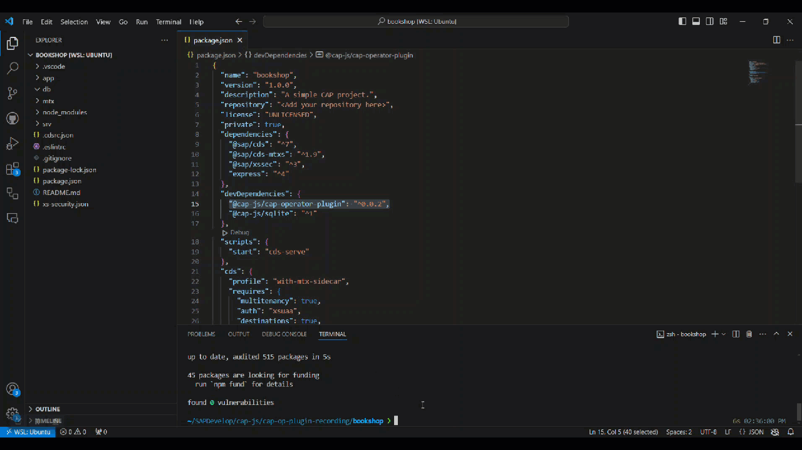

[](https://api.reuse.software/info/github.com/cap-js/cap-operator-plugin)

# CAP Operator Plugin

The CAP Operator Plugin offers a simple method for generating [CAP Operator](https://sap.github.io/cap-operator/) resources, which are essential for deploying multi-tenant CAP Applications.

## Before You Start

The CAP Operator plugin requires `@sap/cds-dk: ">=8.2.1"`. If you've installed @sap/cds-dk  globally, ensure that the installed version is `8.2.1` or higher.

## Set Up the Plugin

To integrate the CAP Operator Plugin into your project, follow these steps:

1. Add the plugin package to your project as a dev dependency:

   ```sh
    npm add @cap-js/cap-operator-plugin -D
   ```
2. After installation, execute the following command to add the CAP Operator Helm chart to your project:

    ```sh
    cds add cap-operator
    ```
    

    This creates a `chart` folder in your directory with three files: `Chart.yaml`, `values.schema.json`, and `values.yaml`.

    You might notice that the `templates` folder is missing. This is intentional. The idea is to push only these three files into your GitHub repository. When you deploy your application, you can call `cds build`, and during the build, the plugin generates the final Helm chart in your project's `gen` directory, which includes the predefined `templates` folder.

    **Available Options**

    * `--with-templates`

        With this option, the plugin also adds the `templates` folder to the chart folder initially. This is required when applications have to modify the predefined template files to support more complex scenarios. If you use this option, you can skip the `cds build` step, as the chart already contains the `templates` folder.

        ```sh
        cds add cap-operator --with-templates
        ```
        

    * `--with-configurable-templates`

        With this option, the plugin adds a chart with configurable templates. This is required when applications need to utilize template functions in the CAP Operator resources. In this version of the chart, all the CAP Operator resource configurations are defined in `templates/cap-operator-cros.yaml`. If you choose this option, you can skip the `cds build` step since the chart already contains the `templates` folder.

        ```sh
        cds add cap-operator --with-configurable-templates
        ```
        

        > If you have already added your chart and want to switch to `--with-configurable-templates`, you can use the plugin to convert the existing chart. For more information, see the [Converting to Configurable Templates](#converting-to-configurable-templates-chart) section.

    * `--force`

        This option allows you to overwrite the existing chart folder.

        ```sh
        cds add cap-operator --force
        ```

    **Experimental Options**

    * `--with-mta` && `--with-mta-extensions`

        Using `--with-mta`, the `values.yaml` can be prefilled with the design-time deployment information from `mta.yaml`.

        ```sh
        cds add cap-operator --with-mta <mta-yaml-file-path>
        ```

        Using `--with-mta-extensions`, you can also pass mta extensions. If you have multiple mta extensions, you can pass them as a comma-separated string to merge them.

        ```sh
        cds add cap-operator --with-mta <mta-yaml-file-path> --with-mta-extensions <mta-ext-yaml-1-file-path>,<mta-ext-yaml-2-file-path>
        ```

        

        As mentioned above, the plugin will automatically inject the templates folder into the final chart during `cds build`. But if you want to add the `templates` folder during chart folder creation, you can use `--with-templates` along with this option as shown below:

        ```sh
        cds add cap-operator --with-mta <mta-yaml-file-path> --with-mta-extensions <mta-ext-yaml-1-file-path>,<mta-ext-yaml-2-file-path> --with-templates
        ```

3. Once you've executed the command above, the basic chart folder or chart folder with templates is added to your project directory, depending on your choice.

## Configure Your Chart

The generated `chart/values.yaml` contains two types of information:

   * Design-time deployment
        * Without option `--with-configurable-templates`
            - [serviceInstances](https://github.com/SAP/sap-btp-service-operator?tab=readme-ov-file#service-instance)
            - [serviceBindings](https://github.com/SAP/sap-btp-service-operator?tab=readme-ov-file#service-binding)
            - workloads - There are two types of workloads:
                - [Deployment definition](https://sap.github.io/cap-operator/docs/usage/resources/capapplicationversion/#workloads-with-deploymentdefinition)
                - [Job definition](https://sap.github.io/cap-operator/docs/usage/resources/capapplicationversion/#workloads-with-jobdefinition)
            - [tenantOperations](https://sap.github.io/cap-operator/docs/usage/resources/capapplicationversion/#sequencing-tenant-operations)
            - [contentJobs](https://sap.github.io/cap-operator/docs/usage/resources/capapplicationversion/#sequencing-content-jobs)
        * With option `--with-configurable-templates`
            - [serviceInstances](https://github.com/SAP/sap-btp-service-operator?tab=readme-ov-file#service-instance)
            - [serviceBindings](https://github.com/SAP/sap-btp-service-operator?tab=readme-ov-file#service-binding)
            - workloads - With this option all the workload configuations are maintained in `templates/cap-operator-cros.yaml` and in the `values.yaml` you can only define the images for the workloads.

   * Runtime deployment
        - app
            - Primary - Primary application domain is used to generate a wildcard TLS certificate. In clusters managed by project "Gardener", this is (usually) a subdomain of the cluster domain
            - Secondary - Customer-specific domains to serve application endpoints (optional)
            - IstioIngressGatewayLabels - Labels used to identify the Istio ingress-gateway component and its corresponding namespace. Usually {“app”:“istio-ingressgateway”,“istio”:“ingressgateway”}
        - btp
            - GlobalAccountId - SAP BTP Global Account Identifier where services are entitled for the current application
            - Subdomain - Subdomain of the provider subaccount to which you deploy the application.
            - TenantId - Tenant ID of the provider subaccount to which you deploy the application
        - [imagePullSecrets](https://kubernetes.io/docs/tasks/configure-pod-container/pull-image-private-registry/) - Kubernetes secret used to pull the application docker images from a private container image registry or repository.
        - env information inside workloads

   As a developer, you must fill in the design-time deployment information in the `values.yaml` file, which can then be pushed to your GitHub repository. The plugin auto-populates some values based on your project configuration, but verifying them and manually filling in any missing information is essential. You can refer to `values.schema.json` file for the structure of the `values.yaml` file.

   **Please fill the `values.yaml` according to the schema as it is tightly coupled to the predefined templates.** You can use a YAML schema validation extension such as [YAML](https://marketplace.visualstudio.com/items?itemName=redhat.vscode-yaml) or run the following command to validate your `values.yaml` file. You can ignore the errors from runtime values as they are not filled in yet.

   ```sh
   helm lint <chart-path>
   ```
## Deploy Your Application

1. You must generate the final Helm chart before deploying your application. You can do so by running `cds build`. During the build, the plugin generates the final Helm chart in your project's `gen` directory, which includes the predefined `templates` folder.

   

   > If you've already added the `templates` folder during the initial plugin call using `--with-templates` or `--with-configurable-templates` option, you can skip this step as the Helm chart is already complete.

2. Up to this point, you've only filled in the design time information in the chart. But to deploy the application, you need to create a `runtime-values.yaml` file with all the runtime values, as mentioned in the section on configuration. You can generate the file using the plugin itself.

    The plugin requires the following information to generate the `runtime-values.yaml`:

    * **Application name (appName) *[Mandatory]***
    * **CAP Operator subdomain (capOperatorSubdomain) *[Mandatory]*** - In Kyma clusters, CAP Operator subdomain defaults to `cap-op`. But if you're using your "Gardener" cluster, you must provide the subdomain you used to install the CAP Operator.
    * **Cluster shoot domain (clusterDomain) *[Mandatory]*** - Shoot domain of your cluster. In Kyma clusters, you can get the shoot domain by running the following command.
        ```sh
        kubectl get gateway -n kyma-system kyma-gateway -o jsonpath='{.spec.servers[0].hosts[0]}'
        ```
    * **Global Account ID (globalAccountId) *[Mandatory]*** - SAP BTP Global Account Identifier where services are entitled for the application.
    * **Provider subdomain (providerSubdomain) *[Mandatory]*** - Subdomain of the provider subaccount to which you deploy the application.
    * **Tenant ID (tenantId) *[Mandatory]*** - Tenant ID of the provider subaccount to which you deploy the application.
    * **HANA Instance ID (hanaInstanceId) *[Optional]*** - ID of the SAP HANA instance to which the application is deployed. It's only required if there are multiple SAP HANA instances in the subaccount.
    * **Image Pull Secrets (imagePullSecret) *[Optional]*** - Kubernetes secret used to pull the application docker images from a private container image registry or repository.

    The plugins provide two ways to generate the runtime values file:

    * **Interactive Mode** - This mode will ask you individually for all the runtime values. To use this mode, run the following command:

        ```sh
        npx cap-op-plugin generate-runtime-values
        ```

        

    * **File Mode** - You can provide all the required runtime values in a YAML file using this mode. To use this mode, run the following command:

        ```sh
        npx cap-op-plugin generate-runtime-values --with-input-yaml <input-yaml-path>
        ```

        

        Sample input yaml -

        ```yaml
        appName: incidentapp
        capOperatorSubdomain: cap-op
        clusterDomain: abc.com
        globalAccountId: abcdef-abcd-4ef1-9263-1b6b7b6b7b6b
        providerSubdomain: provider-subdomain-1234
        tenantId: da37c8e0-74d4-abcd-b5e2-sd8f7d8f7d8f
        hanaInstanceId: 46e285d9-abcd-4c7d-8ebb-502sd8f7d8f7d
        imagePullSecret: regcred
        ```

        Similar to the interactive mode, `appName`, `capOperatorSubdomain`, `clusterDomain`, `globalAccountId`, `providerSubdomain`, and `tenantId` are mandatory fields. If they're not provided in the input YAML, the plugin throws an error.
    After execution, the `runtime-values.yaml` file is created in the chart folder of your project directory.

7. Now, you can deploy the application using the following command:

   ```sh
   helm upgrade -i -n <namespace> <release-name> <project-path>/gen/chart -f <project-path>/chart/runtime-values.yaml
   ```

   If you want to set the `xs-security.json` as a parameter in your `xsuaa` service instance, you can do so by setting the `jsonParameters` attribute on the service instance as follows:

   ```sh
   helm upgrade -i -n <namespace> <release-name> <project-path>/gen/chart --set-file serviceInstances.xsuaa.jsonParameters=<project-path>/xs-security.json -f <project-path>/chart/runtime-values.yaml
   ```

## Converting to Configurable Templates Chart

If you've already added the basic chart folder and want to switch to configurable templates chart, you can use the plugin to convert the chart. To do so, run the following command:

```sh
npx cap-op-plugin convert-to-configurable-template-chart
```

If you want to convert the existing `runtime-values.yaml` as well to the new format, you can do so by passing the `runtime-values.yaml` path via the `--with-runtime-yaml` option:

```sh
npx cap-op-plugin convert-to-configurable-template-chart --with-runtime-yaml <project-path>/chart/runtime-values.yaml
```


## Example

As a reference, check out the [CAP Operator Helm chart](https://github.com/cap-js/incidents-app/tree/cap-operator-plugin/chart) in the sample incident app. Also, take a look at the corresponding [runtime-values.yaml](https://github.com/cap-js/incidents-app/blob/cap-operator-plugin/chart/runtime-values.yaml) file.

## ❗Things to Note

* If you're adding the basic chart folder using the `cds add cap-operator` command, don't modify the `values.schema.json` file. The templates injected automatically during `cds build` are tightly coupled with the structure in `values.schema.json`. If schema changes are needed, use the option `--with-templates` to add the templates folder and adjust them accordingly.

* When defining environment variables for workloads in the `values.yaml` file, it's crucial to mirror these definitions in the `runtime-values.yaml` file. This ensures consistency and avoids potential conflicts, as Helm doesn't merge arrays. If you're introducing new environment variables in `runtime-values.yaml` for a workload, remember to include existing variables from `values.yaml` to maintain coherence. If you use the plugin to generate the `runtime-values.yaml`, the environment variables are automatically copied from `values.yaml`.

## Contributing

This project is open to feature requests/suggestions, bug reports etc. via [GitHub issues](https://github.com/cap-js/cap-operator-plugin/issues). Contribution and feedback are encouraged and always welcome. For more information about how to contribute, the project structure, as well as additional contribution information, see our [Contribution Guidelines](CONTRIBUTING.md).

## Code of Conduct

We as members, contributors, and leaders pledge to make participation in our community a harassment-free experience for everyone. By participating in this project, you agree to abide by its [Code of Conduct](CODE_OF_CONDUCT.md) at all times.

## Licensing

Copyright 2024 SAP SE or an SAP affiliate company and cap-operator-plugin contributors. Please see our [LICENSE](LICENSE) for copyright and license information. Detailed information including third-party components and their licensing/copyright information is available [via the REUSE tool](https://api.reuse.software/info/github.com/cap-js/cap-operator-plugin).
